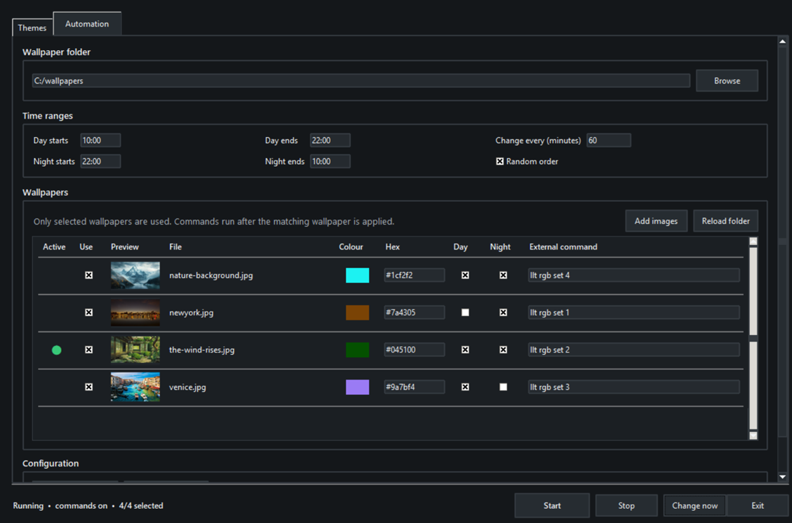

# Windows Wallpaper & Accent Slider

A small Windows utility that changes the desktop wallpaper, Windows accent colour and an optional external command as a single theme.

## Preview



## Features

- Separate day and night time ranges
- Fixed or random wallpaper order
- Per-wallpaper Windows accent colour
- Optional per-wallpaper external command
- Select or exclude individual images without removing them from the folder
- Active-wallpaper indicator
- Image previews
- Add images directly into the selected wallpaper folder
- Global shortcut for changing the wallpaper immediately
- Global shortcut for enabling or disabling external commands
- Bottom-centre on-screen notifications
- Automatic light or dark interface based on the Windows app theme
- Single background instance with persistent Start and Stop state
- Optional start with Windows
- Scrollable Themes and Automation tabs with fixed Start, Stop, Change now and Exit controls

## Requirements

- Windows 10 or Windows 11
- Python 3.10 or newer
- Pillow is recommended for the fastest previews and automatic colour extraction. The app also has a Windows thumbnail fallback when Pillow is unavailable.

Install Pillow:

```powershell
py -m pip install -r requirements.txt
```

Run the application:

```powershell
pyw wallpaper_accent_scheduler.pyw
```

## Default shortcuts

| Action | Shortcut |
|---|---|
| Change wallpaper now | `Ctrl+Alt+W` |
| Toggle external commands | `Ctrl+Alt+C` |

The shortcuts are active while the application process is running, including while its window is hidden.

## Background behaviour

- **Start** enables the scheduler and saves that state.
- **Stop** disables the scheduler and prevents it from restarting automatically on the next Windows sign-in.
- Closing the window hides it while the scheduler is running.
- **Exit** terminates the process.
- Opening the `.pyw` again shows the already-running instance instead of creating another scheduler.

## Configuration

The most recent state is stored automatically in:

```text
%APPDATA%\WallpaperAccentScheduler\last_config.json
```

Configurations can also be saved to and loaded from separate JSON files.

## External commands

Commands are optional and are not required for wallpaper or accent-colour changes (I suggest you to generate them with LLMs if you need personalized commands). 
Example for Lenovo Legion Toolkit to change keyboard color profile:

```text
llt rgb set 2
```

Disable external commands temporarily when keyboard lighting should remain off. Wallpaper and accent changes continue normally.
